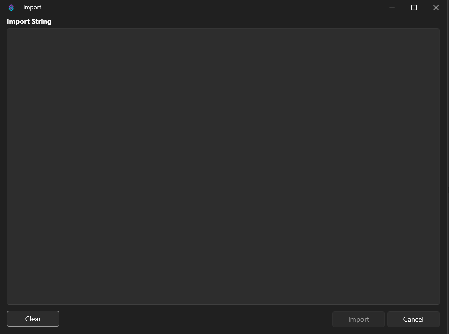
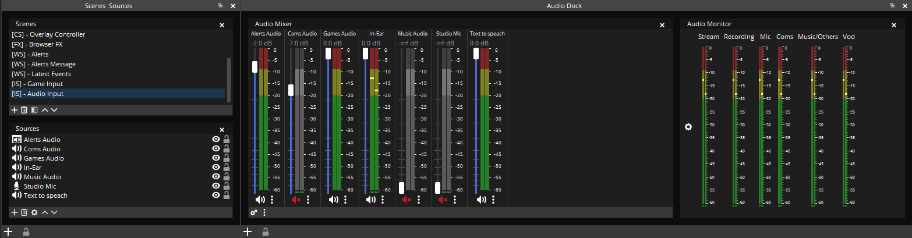
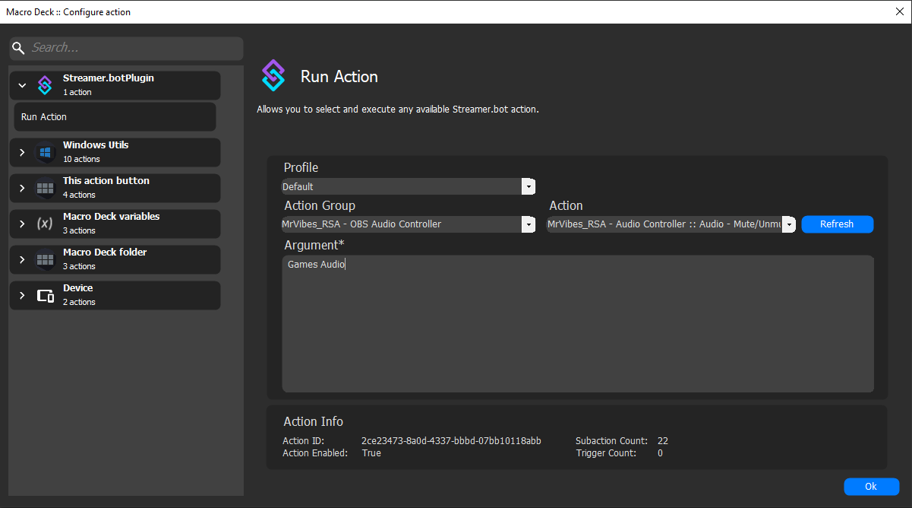
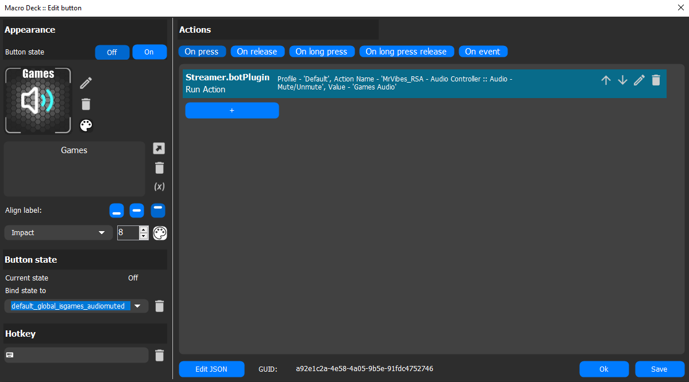

# Input Audio Controller  

This action allows you to control **OBS Input Audio Sources** — including **Mute/Unmute**, **Volume Up**, and **Volume Down**.  

> **Note:** This is intended for users who are managing **individual audio sources**, not those using OBS’s **global audio devices**.

---

## Import Code  

**Copy the following code:**  
```text
U0JBRR+LCAAAAAAABADtXVlz4za2fp+q+Q8u35qnGfQFwT1V82DJliy5rY4la71OpbBRokUto8WyPJX/fg+4iVotr+l0olSn2wRweHCW73wACfm/f//bycnpQM7o6U8n/1U/wI9DOpDw4+n1pOEzOf21Wjs7QSdnc+GPTvKj4WwyCgI5Of1X3J3OZ73RJBrwkAxIWx/kZOqPhqpZ+4K/4LRByCmf+ONZ3Hhy2/OnJ2dc/XxCg9FierIczU9moxMe3fLkW652UhqO57NYldpoPuFy+iWryKg6H0YyQOZwHgRJ28Af+oP5oJFqoxpV229hj1NB10xAQxlTuPJ/0ZWTpCls9kU4H80zsacZyNV1igzPI8ihjCHOTEGkxJbp8US5cNh/5nIeWhbHH7Tjf8lnbaQcUhZIddfZZC7XWh55MBeyMBkNLv3pbDRZQiePBtN9vX6WQ+EPu7t6Hef4k59+iq+hk8YomA/kSX28pm13MpqPtwUpB+6LosjqwYIup+DCXcpN6FCMBqlzt9ohTPh8MpHD2a7W2cTvdsH5yqO/ZBumc3a27ewNh0eRTCe+8kIltlI0LIrC7DTizkHk6n/05fIfW80qVG+XY7nt0Ex8cR0LYnENWZYlkcGIi1zhuMiQXDc1S5hC6luSF9Lv9pQJINc222bRHTWib7aMqTJcSaxnTdq8N/wibYdCPqo7Zq//9q9DtpSPks9nMj8SMrzpqSVdanm2hjgRkEuWpSNqGAz+Z3ONWJJi29yaK+BWbxQOj+JwPQzDLpP58Nuw7t/2JpKKHYERdprSB1mV03kwux01Yi8f6rvW63TrnpH3sGNQQYRAlonBZ9x2EaOuh6RGiGZ61BKMvsZ7LnycD/Gftua/1Q+/rKdZENDxVIqiSvIon5Lmlc+3wVI4lGOmO8jQdQJg6XLEmOEhz7IJN23TJa71g4JlDJJfR12f/5Fw8mACP4CABAnDqhzNMt+jwy7YfjPGRmwaJTqVmDPPdRGmFENaEAJxYHqIUgYIZxJpSm1PRnmuZknLpYh6xEOG68BQ3WPIYRpzhRSe524DcYJ5BsZbqHc4LcIwmCaV4Ze15DgMblu2uQasq83o7EPNY+kGJowBhGocAMe2IcMIDNU9x8O6tJmjuZ9knj3YcXyt9ZXVwvIJlrlQ9vwSWnW7ko7GckLjWN+CzLQKHxGhz5Tk/brv0D8cESXinjpyhMw9csORQJ5n/nDfvDPzX6cs3WDEaPDryqihnVXrP36NrHM9DzYtk0obK/I8ne2LiNW0Ikp0UK+EHa1rkuqw5ed06GE3pd3iGiwpdagJ5MnxbGAVABuurrnI9JipCQPyxd1iFamIA7U47ZMyKrLXaKvKfGoQzwSkspHNORRCG1YNLnd0UMxxCZOe7fAtQpcKOpiNq3nv4mLJ57edoz49xs5zv3uInbN3ijCdGUR3LIKIAHpuOIQix9bBw46rc3C1bkvrx4ww7e0RlpiQSddhHHQ2GZR12wbWLzFirsUZNg0oifh9TGh8ZyYkO024ffGXXcXDf5O2zxkus9rA2q72wyuO44yxH6224+g9KuwBO+qODQtEWI9oOhfIMC0IQu5pSEpiU6ILITTjrXbclcHva8etnNwIpk0DxJO3sbQ0jCF0qNpe0LiOHEl0pBueQQ3OTEm2MvC4jYatls/eaPgQIvksnf8TcUl/uqvSKwttmSUV9fFVPrz/O5V46njccD0dSVejyKCeixzHJMgzCLNM6RDC2SeWeGIz2xKGhixdrYKZ1ACpHAMZuicwkZ7rka19pVTQp5PIeCeTGbbpKk0xYKpBDFjDA+ggmwC6ENvUqbO/pr5/if9EE+5mSS8q8a/V9q8Sn+oQ2ZF5jsewiyAY1Xa6tIAquQZyOAGGKYnLmP3DlngsNN1ktoOEQYDfENdBjmFZyLQsSYjtAVHcmvzvWeLX96IPlvhkI1Ztm8ZbrfG+6daENp45Jtur05NZTyZjR94JPYkqz5ctARPpSZgdlzur7Gn+p7u7JkxhtJje3V37fDKajrzZl8rF7d1dYQJ6LkaTvmXc3T0YX/AXHeuae3c3mPLRJPDZFxHs2Ht5nczaEsrrYI/EL3d3FbmYQcYoQeXpaBh2fCaO2DJ6XqMMJ1qVMRvwbl0PnkSxMfu2wFeb1772g593X688sOJj0NarY0bMp699EbBBY0mb1/b5zVjjJJh3lrlb2argThPPq+TxoT0oTGlr3BPF4IHdTyv5YeOJNs1h6cIMhF59YMPKQ2d4M6/B38+2++a52knttMoY/jwpHeG+C9EsT0GHbps89rh+3b3RcqVa04RrZgDtoNuozC8bPisG96Vi+YGRRbcxcKeiqQWN1tno6gZf5Vtw726/rMZ+DapLWReBuCgsO8uuf9OsYNp053XianxQCUr+osv0Bi5dVjAfhHPuxTa5hevLNqmPlW75m+Be2Unkc2M2vOmyZsFI7lstlro/184W35ZnD1+XOTWvAW0KkF8APethX9rUNHazLUfEMup6NeD5M7d0XrJL+d1yeNgn9wQ+AFuMwjnCtWVo48tywFuNAH6+aLeqvdI57paGM16COYG98O2gMOs0Fv63YOGX/LNJqVi4D/0YVB5Eq3zfqcG1fJmXhtiP50varVKXKl8FiW1Av4vKTS1v/tweVm47TbNfHxT0q3z5stOqltkwp4lC54FdNmadWmm6qdPVbeQXMSgsS8UqxNEF2C2nxobtX/udJSPaFSfu/Ko4flI+EJdlFbfjKD5G5Xyr0+N+jjDyqLFmXY1P4wh8/QCxgq+fSqNOsYDbNXNdp3rVT3SgzXb36jLR9cwpFbWezPaLfBXGm7JFcr+rJ7zus3MlT/XdkvnP3TL7ZbmI/oa5JH3dzb7f4j7eTTzvG8jbyBZdThq4Gs4PxuXLdisP19U8L8weazZ46X7MS36pe7Udy3DtzG/lwTeFhQ9xsxCtajOaW+OiDbHxLRq3mi/092qlxA7n9Yvu/JaUn+qkMe8Uyj0BOQX/xrU1WXX/K8Rp4tfI5rGNPiCe8s1XxlI8H6V/gm8NiE1Q1O/EP7f02YYNG25LS/2UV/jxXKzl6+Ecb0G3S1Z0/XbzsQm5BQqUh/HPniQb+djSvARfbluN6f77AK7k+5F/WjjChEEDg4x56bK6FM162JbE0T7srBZdnfndseoTxWdkm8Zl2ayCfW5a5SH4JbcRT8rPoO9NN8WhLVyJdWtWFP7jUjGYA/bNoO8q7nwVx/jx+vwMsM95gJh4YIPOuKPuAfWgUwv7j1mrMdshK47Vxi3UtYXCvev7aRcwtLtH1lPY77IyloN6HJeZ3Bo0HkWz8SQukpg686WW5sq3NtgK8seCP34pP+22N+sJXCtBHqU5E+HVf1Qc1hMbgY5hbeq7PtcqUHertXaLj0p9VacivE78ovy+odM4i8+dBAcu1NiwfV4dgm/rKuaN0Xq+hb5YYfBlBn+UnYadgEN9bhRdiLGbp2u/149yaV0nqHeJDuOOfzZK8LB0bkCtC+bZfpEN4jzI4t2FBroClkBtzGDmLNWpAbyjdTYFXByzYDOnIixZ1b5K8FZ/QRyntXKlP9TD+1E4Lp2j6p/WyJhjbPoxqOz2Y4rbKz/km2vYFNazXRhb3Y2xy06roHWAo2XkKlzrJxygmt7TLPKBO4u4V28tHrM2jTiT0l9MGSn3WEHFb7dfGiQ/u/amDb2Gm+byjQ84HdX2eW2zvvh9+31wV2He3vtURHORxKcbxV85EJeNJfNzmA8bQdimsNJXGHEGcw9WvHPgPrB8biWrVQ2u8n3VJ9I9wvI6Hwaq1uT4QOXtJuYp3VwNsCnFlU2bJbXhMEdVMXUQY++hZu6X9fSoOOY/AbeL7WY1qBPtgenVUSgj4b0Rhg422xOZ4ZxrgKMQB1A3VFwFpWKn11F8NNM/wuVgUMr3tmSVzhfAa8/G0bjGLWu6D6LYi+P9bHl9nrlXK+XhG7H9Wq5Tdkv3Wd75AfkWYfwrcy7C8RWGQm2AfgLWYgLijGHwz/n18uq5nDqCY9SBP4lBALFUScbv4B1YzTPhf3Ee9UP7fV06oFth2tYb0zAOLhVG555KRTPogM87EEdML6Vx0VH1aVDodyIuHa53wjXM5bWyewVkjL72gffmu49f85k6Ahh7fXu2uKqdPcB6KK016fiLasCKBVPZCuoHpnkTZHVH17VFdL9GZcaIi2kxrXmAOaGMUL+rKObHIVc4n3ap4v/JXPLtQSnL4RNeUuxPrpaRHRL+nvVZVo/VPEA+5NnX24vFdT6D+asYTznyq9drID/NiQz3VDUvHLeai+qf5kIcL5u8+3Y3707ra5Y7p3sDjWJv2WkW+iquAX9GwFd6HYhFVgSunu+FfKtaVDHTX8flaD2k1roF4HOAi/WugLxV49uk2+20eiqnpxJ4gYoHwPt8BmdWa0A/at9Ys6XY2wGbQvx/mJ1D/16+jhNkdUsw17tZ5VxWlijEOkH9A5sC3y3gTq2X4l5b4RfkwGatgdxaJLL3rQ2i++2tgw02UPesf+T+ysH1RjS3Q3U1rJV7Zf2scv7cgFq9VYPS+grxi3fUqFXMf0odzGDdFl7X03pV3eBOyfxeifchL9qq+ReVHoc2quaYyrpe1SqIP5hPt3NRWu1x1XI9NrjpAqY8gXzoE+Cyft1lAxdsWwbcdvUYU6N43D3HbG0Icxt0TK6NoZYuII4J+F3jCSeEuAeMXatXf+2NvW5vbBXrjTmsuQFjcgPaKqs9yycG+SuakJPL3H27aQBO1Lu02Ohx5fPLRsxPw7yANbvxnhj2uCs+WbGisVBGtK7ny7dxkF3x+LW24kOlvAM1PdnTCHlEtr7tkPkMt252HjisoSPs6cf7yIqbLFI9y347ww8Xu3DhaH4CPlnnWf5OeVt7ZLdFdwjxM2BLWAsGKaewvvk5O5Hn1RKu9oOszRsVU/mA1cw6BRu1VdwPeMp3YJ087TQbi6uIO150mo89WVvfi1vFamPOod5BnOrwR42/p/lcIEOseTShHo/gOm5Dreq0Vs8FdvKdfG4H/q37frVW7IDOhekH7xfv0OcNfHNN5/U9g7U47Ef9SoX1eNyO54Zb8nf4Zd++wBCHdTjdK73M9fiwOm43F+lzqXSNB7iibB7uNxZmIT5D3X3gRVi/XfZH23Fb8q8ayd5DLuVbHeA17cFjULrY6t+Vy5yKCTvMJVivxHu54R5nE4e14AbWmQuF87LW3fST2g950T3D/ebLabcDc/wWrlHUvd9gl8ucus+4vVRYCTjUzPSr5bJr5JTXhbXVBzy8NbphW3+1PwlYCzqV4b6PYzlo/NwejIO2fuOkMm/jfU/I63QtDf4I97UuVQ6LpxCDt+ZTgfyrKj3voaY8QS25Xd2nDv2nWzaEPFPPQ+8z/BbW7NHeq+J2ICOt4cp/rNhW685/li5Cv2XqcyWA8YpbWp2669NB417A2gkwZQD4l3lWWgr3zYRa2+rXId5G8TCGnIZ6MYCczq/snD5Hzdghfo4axs+OuYfYBveDdVcuimei6nr47DfgGRuWCpl/Q41hg4Yezytjt8ZypW/Fvm02cDt8XlNYxWy9B5yxOk32xp/r87UfDIFPLhVPUP7uNFQcVoJasTDvFB+TfR1l86BeLCwB20ttwBwW7geY30C/YN2m5VB/CdfFMleGOYdjG8UAeFESd2Db4Wx1vVHBsvkY8JD3KV0bdRo9EzRh3fv0tQ/xo6t97MacttR44CqXmgv3dSOf/fvfW+81jCeSjwZjf/+5RyEDuqzN6GTXsbGwx4econzVudAjT1G6H/LmytpL3S84RZkd9oo3co97wyejTvLPQ4c2NZNZXKMUMRfryMDSQK6tG8gWhiNN5mj2+mm0H+jQ5sYJ9/PRYvhHOrv5RznjznQubaphpOsmBLpLPUQx8ZDtUcfSTCyF3L7xn/mM+2Yghp1+v1PuHEBAOgwjTdoMGY5LkMMpRkwjBKDKg7/In+iUO+GA0oYNaE2xUEfdbcQYEwjbjGlY09T3g/zggKlevf/f+nAAf/0JADOxT03OTs4mXUjQ4Wy6FfAQTtE35PwPxg78t53Ah15zfsV5kU0cL1Ahb/3BFpTGnSMc13a+3fz8WYkUyqXQNMNF2MMmcBbCERW2gSSVOpXc0ineeRTy2PertyE9bM2+2G9KR3hUGMhysYMMZliImpqBhHqDXujYc5mzU4UPf4/96HNIYe9DZ5HCDi87jxQOOcKPrz9D9Oxr+kfKP3CPeN7H85ONgbsPCoWnlQ6OPO6sUNg1Pk0HZFkTUBIxdz0oiRZDTDeB0rgO1kwLaqKz8yhhKuaIAy9hv4N5kfbK5ocwpdAJcCzdVefhMYNqbWOOBLWpFKbt0t1HIFJhRx1+iWxx6AyR+uw4BKM+uw5wRALfPIOXnCTadygm7JM1qeW6hGLXQsRSX9jhqa/5MQVBmmUahuV5/NBXDHz6caw/UJ7uWlOsdX1xYmJieEBQNeQxaiADihNijoClBydE9wg1Kd57kC8U84GJyS1BuC2QppDCEA5DDhYMmZorNYKZyfDeKAqF/f6J+YYZvDQxjzon+YmJ+Q6H/F6r7fHkaWfrJ5OnVx5ee41mRy4y8e9+Qj1ZQdyOut1AnoQ87uACwoD/PnwBcfDo9YGz4Fmg338K/JgT4Nlz6dmNCH+6X6yQHp0Hs0ZcRPaeGU33lh1pMQ+52IScI56GmFS7UABenmUI12Nv+s4HjTx3rPbUMoUnuCuAxJjqYDR2keu4HFm6TZmgmECE/t4Lll9/jYLhrUuVbzHx/nFXJzFaWdKmQESRYRk6MkxiI+pyF9mGYMQiFsb6O/P/fYfew17ZcMO6o1FPJ8gjCkilaUHsCw3pBrMJ8CFuud73TTPeMoMP4f/Y8zSXa7DaY5QAdOgAJ1w3EMHYcTSDcf0A7/lh+f8KPWK4PkzlnwORtGMKJrdgr/daHRw3XfU5MOVQ0lHmfcV9j7h3KPFdHjnslLz1VbtbG7x7hx7zcGLnwBc8sNg7/vBDjJ3D4vWMy00NijMyTQmLRYN7QA44QzqWHrN0i3p87xe7rYk7Es3T/gcegOzsv0YnDN0zTBv4g8kY0AmdwSpCY7DglZppaJZBrZ0Ufkvo0TifjngW75PPbsDKfo6J9My+e7oFeoKi2DhqhuOJ9HylsPru1SpdHBfK0A9G/Pducjc8Obk7ncj/zIGlKpy5g4a7NXXuTv+10e+czqjqF49XLekmZDR+nT+nEtKeIZbeJUkQNf6m/vrtOP3DbJrejs4m3ekLnMtHw6EMNYuL3gsfVu0VHH/5mq4B2yYasjRpqoeIFDEOlJwLi9gWc6iUBxlTKu6VuWZY30GiHQ1rB3cdsp/3ybTjvh5sbchbl4dbAo/8wrC1Mc9+ediGyoeXjFsDjucX6ZD4MZkjLGZyjCzp2FBY1Hs6jBBkMgmBI6SFrb1fPrUm7pXBvv9rxtZ6f2dlZedXZWY/e5YTyWffsmJ1o3eb6Uscc8xyI+275hJGXEe3LYQtA8Mi01Pfl0ptJD0beIvruYQcfJITCnyRO46r8Icx5y/+nPDn6x+bPXPD0GydMGRLjSODmgK5JncgWj3MdMKJifl3x545Ny3iGQ6yDfCzoUmOmPI4kZ7jQfZrJn02p0Khf1T2PHtmUZ2O/4OTZzXPH4U7c+bojgGpJQ1YrBquRhCVWCDGMGYCG7bGP5ROvJw7f0Ca/cWd9wv8PO58rPRXU2fLdC1XShsRVz0kFaaFmI0psoTueZQ5mrX/q9nXxH0edf4OasonUef3mOlrqfNzbvleqPNB2DnghkMuSHLjjbN6+VOng73WfqMC8D/DEh7kqWGo56wSFlUeqEaEYRmEO6bznb/c8pYZfMjLLZ/41OkdXm55rbbv+HLLJzxof+XLLa/R7Pd9ueW1Jyiyw06FbnHTZgbSdGkhQ3cocoGuIs9ihq5+QSLXNnZaTk3q2BQ7HjJ1tXMmhEQOA5yzqOYaHtYgGzcWlaee5bjCsinydK6Op3AgxsIgUKNsV4cxxJab5+g0W9o2ljpimMHS1XMYcpkHrNrFwiI689jma+yn6oCdKQRwcFMDxag69QFKIWFz1zIlNXS6ORdsuK70BEa2rjYWDJMgF9sm/Ohw17Yw9jR78y4vfkXsuMTLODD5Z+zUxKHRKZW1YxLg38GADsX6xYVk0xHvy1lNTh42DlasGvOBH56SyDbO/EHSX12Jfyvv6pcHx69SnsrH8WgCZFYdW1HZo36ncHwEcft3/Ea/cRjRYNyj0Ovvf/vt/wGltje/8HgAAA==
```
## Installation
1.In **Streamer.bot** in select **Import** from the top left.

2.Copy the **Import Code** and paste it into the **Import String**.
+ Example:

+ After importing, you should see 4 new actions appear in your list:
+ Example:


***
# How to Setup
Let’s set it up for use with [Macro Deck 2][Macro-Deck] now that it’s imported into [Streamer.Bot][StreamerBot].

**Step 1 — Identify Your Audio Source**

In OBS, decide which audio source(s) you want to control and note their exact names (case-sensitive).
For this example, we’ll use **“Games Audio”**.
 
+ Example:


**Step 2 — Create a Button in Macro Deck 2**

Create a new button to mute/unmute your chosen audio source (e.g., Games Audio).

+ Example: Button off State

+ Example:Button On State


**Step 3 — Add the Streamer.bot Plugin Action**

With your button selected, add the Streamer.bot Plugin Action:
>MrVibes_RSA - Audio Controller

In the Arguments field, type the exact name of your audio source — for example:

>Games Audio

*(Make sure the name matches your OBS source exactly.)*

+ Example:


**Step 4 — Test the Button**

With both *Streamer.bot* and *OBS* running:

- Right-click your button in Macro Deck 2

- Select Simulate → On Short Press

Your chosen audio source should now mute in OBS.

At this point, the button itself won’t yet update to reflect the mute state — we’ll handle that next.

+ Example:


**Step 5 — Bind Button State to Streamer.bot Variable**

Edit your button and find the Bind state to option.

Select the global variable that Streamer.bot created for your source — for example:

>global_isGames AudioMuted

You can select it directly from the dropdown list.

+ Example:


**Congratulations!**

Your Macro Deck button is now fully set up and synced with OBS. Enjoy your new audio control setup!

## Contributors
 - [MrVibes_RSA](https://www.twitch.tv/MrVibes_RSA)

 + [More Actions](https://github.com/MrVibesRSA/Streamer.bot-Actions)


 [Macro-Deck]: https://macro-deck.app/
 [StreamerBot]: https://streamer.bot/
 